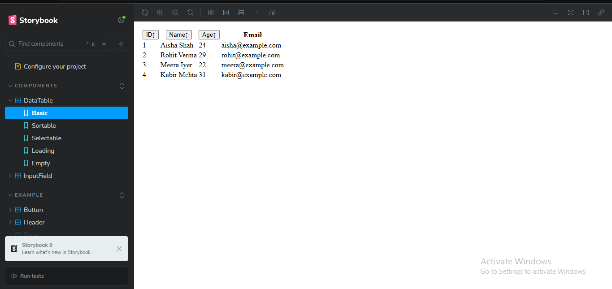
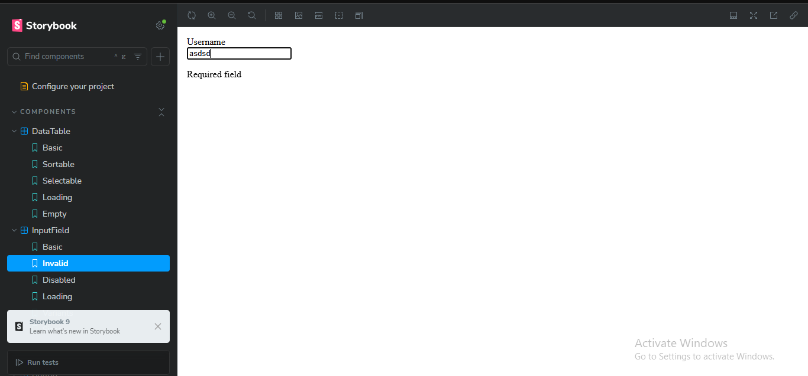
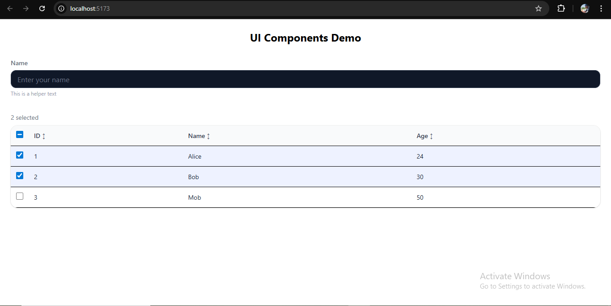

# React UI Components – Input Form & DataTable  

This project is a small **React + TypeScript + TailwindCSS + Storybook** application showcasing two reusable UI components:  

1. **Input Form** – A form with input validation, accessibility, and styling.  
2. **DataTable** – A dynamic table with sorting, row selection, loading/empty states.  

Both components are designed to be **responsive, reusable, and easy to extend**.  

---

## ✨ Features  

- 📌 **Input Form**  
  - Reusable input field component  
  - Variants: `outlined`, `filled`, `ghost`  
  - Validation + error messages  
  - Loading and disabled states  
  - Accessible with ARIA support  

- 📊 **DataTable**  
  - Display dynamic tabular data  
  - Column sorting (ascending/descending)  
  - Row selection (single/multiple + "select all")  
  - Loading state & Empty state  
  - Responsive and accessible  

- 🎨 **Tech Stack**  
  - React (with Vite)  
  - TypeScript  
  - Tailwind CSS  
  - Storybook for UI testing  

---

## 🚀 Getting Started  

### 1️⃣ Clone & Install  
```bash
git clone <your-repo-link>
cd project-folder
npm install
```

### 2️⃣ Run the app  
```bash
npm run dev
```
Visit 👉 http://localhost:5173
### 3️⃣ Run storybook  
```bash
npm run storybook
```
Visit 👉 http://localhost:6006

### 4️⃣ Build for Production
``` bash
npm run build
```
### 📂 Project Structure
## src/
 ### ┣ components/
 ### ┃ ┣ InputField.tsx
 ### ┃ ┣ InputForm.tsx
 ### ┃ ┗ DataTable.tsx
 ### ┣ stories/
 ### ┃ ┣ InputField.stories.tsx
 ### ┃ ┗ DataTable.stories.tsx
 ### ┣ App.tsx
 ### ┣ main.tsx
 ### ┗ index.css


## 📸 Demo


Datable Storybook Screenshot


Inputfeld Storybook Screenshot


App Running Screenshot

## 🙏 Acknowledgements
- [React](https://react.dev/)  
- [Vite](https://vitejs.dev/)  
- [Tailwind CSS](https://tailwindcss.com/)  

## 👨‍💻 Author
- Name: Nehanshu Parikh  
- GitHub: [@NehanshuParikh](https://github.com/NehanshuParikh)  
- LinkedIn: [Nehanshu Parikh](https://www.linkedin.com/in/nehanshu-parikh)